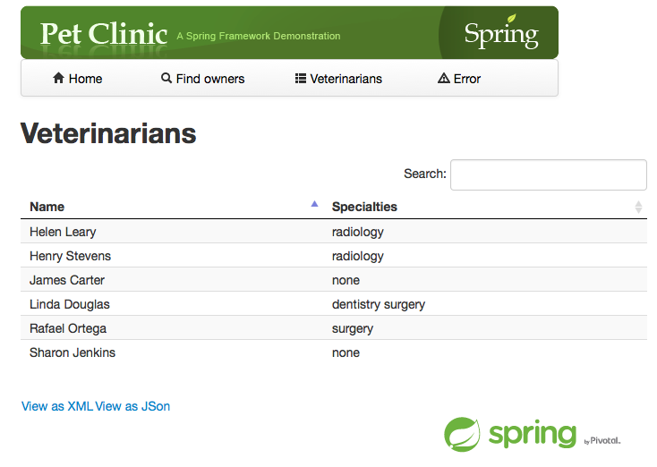

### What is the client Java app ?

This is a customized version of the [Spring petclinic application](https://github.com/spring-projects/spring-petclinic) that is a typical Spring App, using ehcache for caching the list of Veterinarians.
Of course, the customized version used for this Docker example configures a clustered cache ready to connect to a Terracotta Server Array instead of a standalone cache - [you're free to check out those changes](https://github.com/anthonydahanne/spring-petclinic/commit/a1bc1da33de0a9e55a47cc5b8a830d9719f49ef5)

### How to use this image: QuickStart

If you want to connect this client app to a Terracotta Server Array running on a host with the IP 192.168.59.103 listening on port 9510, first start your Terracotta server.

Start the server

    docker run --name tc-server -d anthonydahanne/terracotta-server-oss:5.0.0

and then start the client :

    docker run -d --name petclinic -p 8080:8080 --link tc-server:tsa anthonydahanne/spring-petclinic-clustered:5.0.0

You can have a look at the logs using

    docker logs -f petclinic

If everything goes well, you should see :

    INFO - Connection successfully established to server at 192.168.59.103:9510

At this point go to http://DOCKER_HOST:8080/ from the docker host machine to interact with this client webapp.

Go click on "Find Owners", launch several searches,you'll them they're getting cached, in the log :

    org.ehcache.Demo                         : Returning cached result for VetName

Click on Veterinarians, you should see this list of Veterinarians stored in the cluster :

### Using docker compose to build and run them all at once !

In the current folder (client) there is a docker-compose.yml file that will allow you to download and run a Terracotta Server instance and a Petclinic client.
It's as easy as typing :

    docker-compose up -d

And you'll be able to access the client app on http://DOCKER_HOST:8080/

### How to build this image

Once Docker  is up and running in your environment, cd into the server directory containing the Dockerfile and terracotta folder, and :

    docker build  -t spring-petclinic-clustered:5.0.0 .